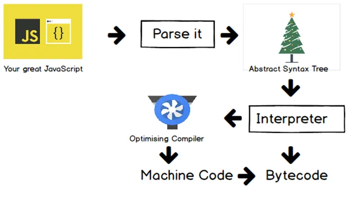

In programming, we generally write a computer program using a high-level language (Javascript, Java, Python,..). However, a computer can only understand the machine code (0 and 1)

To `convert source code into machine code`, we use `either a compiler or an interpreter` to convert source code to machine code but they still have some differences

# Interpreter (Trình thông dịch)

The Interpreter can `parse the source code to byte code` and `execute it immediately` without requiring to compile to machine code. Thus, the speed of running can be quicker than the Compiler at the first time

That's why Javascript is `a interpreter language at the beginning` but there is a Cons with the Interpreter. The code get slower and slower because the code is not optimized for heavy tasks

# Compiler (Trình biên dịch)

The Compiler `take a little bit of time to get start up` because of the compilation step at the beginning but `the Compiler knows how to optimize the code` to run faster

The Compiler works ahead of time to `convert instructions` into `a machine-code or lower-level form` so that they `can be read and executed by a computer`

# Just in Time (JIT)

 

 

Both Interpreter and Compiler `have Pros and Cons on their side`. Therefore, JIT Compiler combine the Interpreter and Compiler into one (V8 is an example)

Step 1: the Javascript Engine `start parsing the code to AST` and `get sent to the Interpreter to create the byte code`.

Step 2: The Profiler will `take care of monitoring and watching the code` to `detect code that can be optimized` and `send to Compiler`

Step 3: The Compiler takes the code and `do the optimization step`

Step 4: The `optimized code will be replace` where it could be improved of the byte code. It `mixes and matches` things and it `constantly runs through this loop`

Summary, the Interpreter `allows us to run the code right away` while the Compiler `do the optimization` the code when the code is running
