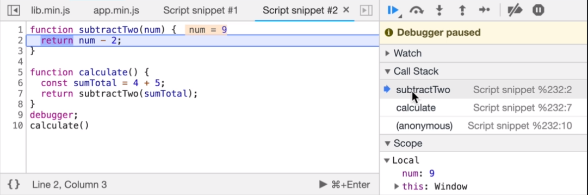

# Call Stack

The Call Stack `keeps track of where we are in the code`, so we can `run the program in order`. It runs in a `Last In First Out (LIFO) mode`. Each call stack `can point to a location inside the Memory Heap`

 

 

 

# Memory Heap

The Memory Heap `stores and writes information`, where `the memory is allocated, used, and removed`
