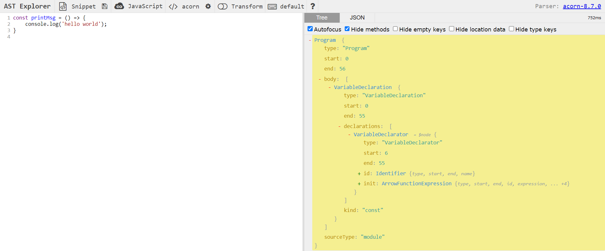

# What is Javascript Engine?

A JavaScript engine is a computer program that `translate the JavaScript code to machine code` that computer can understand

There are many types of Javascript engines and all of them must be `standardized by ECMA Script`

- `V8`: by Google, is used in Google Chrome, Node.js, Deno, and V8.NET
- `SpiderMonkey`: A JavaScript engine in Mozilla Gecko applications, including Firefox
- `Chakra`: A JavaScript engine previously used in older versions of Microsoft Edge
- ...

The JavaScript engines are `embedded in JavaScript runtime environments` such as

- Browsers
- Node.js
- Java Runtime Environment (JRE)

 

# How does the Javascript Engine work?

In modern engines, `the Interpreter starts reading the code line by line` while `the Profiler watches for frequently used code and flags` then `passes is to the Compiler to be optimized`

In the end, the JavaScript engine `takes the bytecode from the Interpreter outputs` and `mixes in the optimized code the Compiler outputs` and then gives that to the computer.` This is called "Just in Time" or JIT Compiler`

 

 

## 1. Parser

The Parser starts to `read the code line by line`, `checking it for errors`, and `decodes the code contents into token` which can be used for create the `Abstract Syntax Tree (AST)`

## 2. Abstract Syntax Tree (AST)

These token `will get formed in a tree` called Abstract Syntax Tree (AST)

 

 

## 3. Interpreter

_Refer 3. interpreter, compiler and JIT.md_

## 4. Compiler

_Refer 3. interpreter, compiler and JIT.md_

## 5. Optimized code

The optimized code can be run more efficiency and faster
