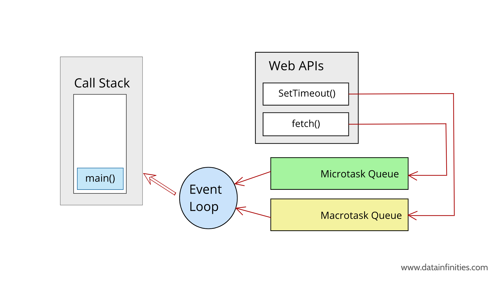

# Cons of Javascript Engine

As we know before, `Javascript is a single thread language` because there is `only one Call Stack and one Memory Heap`. All `rest tasks will be pending` if `one task takes a long time to complete`

# Javascript Runtime

The JavaScript runtime environment `provides access to built-in libraries and objects` that are available to a program so that it can `interact with the outside world` and make the code work

In the context of a browser, the Javascript Runtime includes

- JavaScript engine - which is made up of Call Stack and Memory Heap
- Web APIs - from browser
- Microtask Queue - run on FIFO, used for Promise, queueMicrotask or Mutate Observer
- Callback Queue (or Macrotask Queue) - run on FIFO, used for setTimeout, setInterval...
- Event Loop - Check "Is Call Stack empty?"

<br>

<br>

`The Web APIs come along with browser`. With Web APIs, we can do

- Send HTTP Request
- Listen to DOM event
- Delay execution using setTimeout, setInterval
- Caching or database storage

Underneath the hood, `the Web APIs` allow us to `do async tasks in the background` while `the synchronous Javascript code is still running`

# How the Javascript Runtime runs?

<br>

<br>

1. The Javascript engine starts to `execute the code line by line`. In case of there are any async task (setTimeout, fetch data...), these async tasks `will be sent to Web APIs to do in the background`

2. The `remaining code will continue to execute` until `the Call Stack is empty`

3. After the `async tasks in Web APIs are done`, they will `be pushed to the MicroTask Queue or Callback Queue`

4. The Event Loop checks the Call Stack regularly. If `the Call Stack is empty`, `all tasks in MicroTask Queue` will be `pushed to Call Stack and execute first`, `all tasks in Callback Queue` will `come later`

```
setTimeout(() => {
  console.log("setTimeout");
}, 0);

microtaskQueue(() => {
  console.log("microtaskQueue");
});

console.log("Main code");

Promise.resolve().then(() => {
  console.log("Promise resolve");
});

// Main code
// microtaskQueue
// Promise resolve
// setTimeout
```
