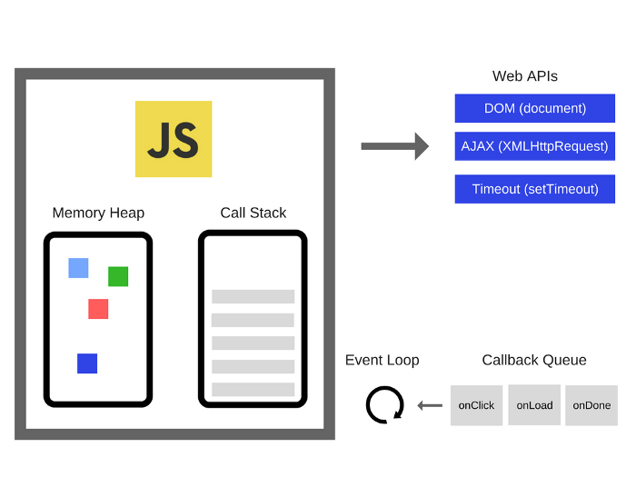

# Javascript Runtime

As we know before, `Javascript is a single thread language` because there is `only one call stack and one memory heap`. All `rest tasks will be pending` if `one task takes a long time to complete`. Therefore, Javascript Runtime comes in

 

 

The Web APIs come along with browser. With Web APIs, we can do

- Send HTTP Request
- Listen to DOM event
- Delay execution using setTimeout, setInterval
- Caching or database storage

Underneath the hood, `the Web APIs allow us to do async tasks that work in the background` while `the synchronous Javascript code is running`

Here's what happen

- The Javascript engine `execute the code line by line`. In case of there is on async task (setTimeout, fetch data), `that async task will be sent to Web APIs to do in the background`
- `The rest of Javascript code will continue to execute` until the Call Stack is empty
- After the `async task is done`, it will `be pushed to the Callback Queue`
- The list of tasks in Callback Queue `will be added to Call Stack` when `the Event Loop make sure the Call Stack is empty`
